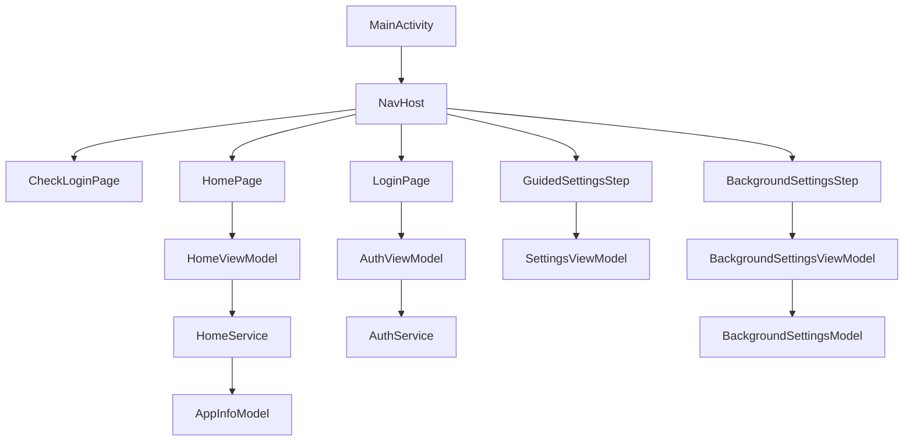
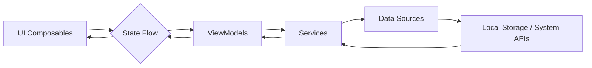

# ARCHITECTURE - Launcherly

## System Architecture

Launcherly follows the MVVM (Model-View-ViewModel) architecture pattern with clean architecture principles. The app is structured into multiple layers that separate concerns and ensure maintainability.

```
┌─────────────────────────────────────────────────────────────┐
│                        UI Layer                             │
├─────────────────────────────────────────────────────────────┤
│  Compose UI Components (Views, Screens, Components)         │
├─────────────────────────────────────────────────────────────┤
│                     ViewModel Layer                         │
├─────────────────────────────────────────────────────────────┤
│  ViewModels, State Management, UI Logic                     │
├─────────────────────────────────────────────────────────────┤
│                    Domain Layer                             │
├─────────────────────────────────────────────────────────────┤
│  Business Logic, Use Cases, Models                          │
├─────────────────────────────────────────────────────────────┤
│                    Data Layer                               │
├─────────────────────────────────────────────────────────────┤
│  Repositories, Data Sources, API Services, Local Storage    │
└─────────────────────────────────────────────────────────────┘
```

## Component Responsibilities

### Application Layer
- `LauncherlyApp`: The application class that initializes Coil image loader with custom configuration

### Presentation Layer
- `MainActivity`: Main activity that sets up the navigation graph and handles system broadcast receivers
- Navigation: Uses Jetpack Navigation Compose for screen navigation
- Views: Compose UI components organized by feature in the `features/*/view` directories

### ViewModel Layer
- `HomeViewModel`: Manages the state for the home screen, including fetching favorite and all installed apps
- Feature-specific ViewModels: Each feature has its own ViewModel for managing UI state and business logic

### Domain Layer
- Models: Data classes that represent business entities (e.g., `AppInfoModel`)
- Services: Business logic implementations (e.g., `HomeService`)

### Data Layer
- Services: Data access implementations (e.g., `HomeService` for fetching installed apps)
- Shared Preferences: For storing user preferences and settings

## Dependency Injection

The application uses Hilt for dependency injection:
- `@HiltAndroidApp` annotation on the `LauncherlyApp` class
- `@AndroidEntryPoint` annotation on activities and fragments
- `@HiltViewModel` annotation on ViewModels
- DI modules in the `core/di` directory

## State Management

State management is handled through:
- Kotlin Flow for reactive state updates
- StateFlow for exposing immutable state streams from ViewModels
- Compose's `collectAsState()` for observing state changes in UI

## UI Architecture

The UI is built entirely with Jetpack Compose for TV:
- Uses `androidx.tv.material3` components for TV-specific UI
- Navigation is handled through Navigation Compose
- Theme follows Material Design 3 guidelines with custom colors

## Key Libraries

- **Jetpack Compose**: For modern UI development
- **Navigation Compose**: For navigation between screens
- **Hilt**: For dependency injection
- **Media3**: For video playback capabilities
- **Coil**: For asynchronous image loading
- **AndroidX Lifecycle**: For ViewModel and lifecycle-aware components

## Diagrams

### Component Architecture


### Data Flow Architecture
